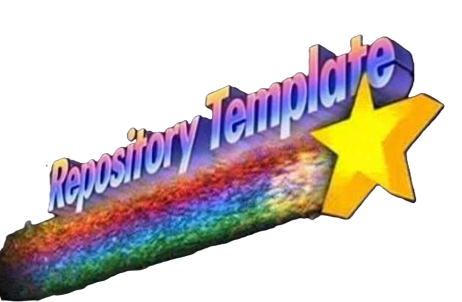

  

   

  &nbsp;&nbsp;
  

# Simple README.md

  

  &nbsp;
  &nbsp;
  &nbsp;

***

<h4 align="center">

  [Manual](docs/man/README.md)&nbsp;&bull;&nbsp;[Changelog](docs/CHANGELOG.md)&nbsp;&bull;&nbsp;[Roadmap](docs/ROADMAP.md)&nbsp;&bull;&nbsp;[Known Issues](docs/KNOWN-ISSUES.md)

</h4>

***

| CONTENTS |
|:--------|
| [About DVN](#about-dvn) |
| [The DVN manual](#the-dvn-manual) |
| [License](#license) |

# About DVN

**DVN** is a command-line utility for managing development environments.

Let's say you are working something called "MyProject", which requires:

* A Visual Studio 2022/2026 solution named "**MyProject**"
* A Visual Studio Code workspace named "**MyProject-Documentation**"
* A Visual Studio Code workspace named "**Other-Documentation**"
* GitHub Desktop
* A webpage containing API documentation
* Additional project-related specific data that should be backed up

You could do all of the above steps manually, ***or*** you could let **dvn** do it for you by typing: `dvn myproject`

<!--
### Features

* Feature — What it does and why it matters.
* Feature — What it does and why it matters.
* Feature — What it does and why it matters.
-->

<!--
### Built With

* [Technology or framework](URL)  - Role it plays in the project.
* [Technology or framework](URL)  - Role it plays in the project.
* [Technology or framework](URL)  - Role it plays in the project.

-->

# The DVN manual

For more information about **DVN**, including detailed usage instructions, please refer to the [Manual](docs/man/README.md).

# License

Copyright &copy; 2026 [A Pretty Cool Program](https://github.com/APrettyCoolProgram)  
Distributed under the [Apache 2.0 License](LICENSE)  

---

<h6 align="center">

  [FAQ](docs/FAQ.md)&nbsp;&bull;&nbsp;[DEVELOPMENT](docs/DEVELOPMENT.md)&nbsp;&bull;&nbsp;[API](docs/api/README.md)&nbsp;&bull;&nbsp;[TESTING](docs/TESTING.md)&nbsp;&bull;&nbsp;[SUPPORT](docs/SUPPORT.md)&nbsp;&bull;&nbsp;[NOTICES](docs/NOTICES.md)
  
</h6>
